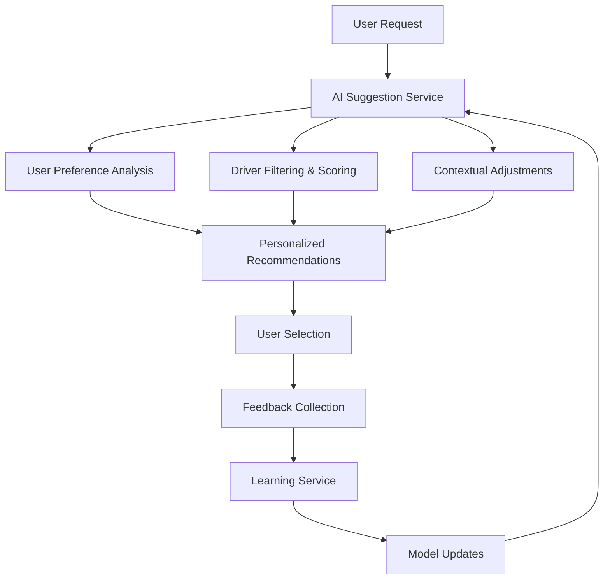

# 🤖 AI Driver Recommendation System

## Overview

This React Native ride-sharing app features an advanced AI-powered driver recommendation system that learns from user behavior and provides personalized driver suggestions based on multiple factors including user preferences, ride history, contextual information, and real-time conditions.

## 🎯 Key Features

### 1. **Intelligent Driver Scoring**
- **Multi-factor Algorithm**: Combines distance, ratings, car capacity, time patterns, and user preferences
- **Real-time Contextual Scoring**: Considers weather, demand, time of day, and surge pricing
- **Personalized Weighting**: Adjusts scoring based on individual user patterns

### 2. **User Preference Learning**
- **Automatic Pattern Detection**: Learns from ride history without explicit user input
- **Dynamic Preference Updates**: Continuously adjusts based on new rides and feedback
- **Smart Defaults**: Provides good recommendations even for new users

### 3. **Machine Learning & Continuous Improvement**
- **Feedback Loop**: Records user satisfaction and selection patterns
- **Model Optimization**: Automatically adjusts weights based on performance
- **Performance Analytics**: Tracks accuracy and satisfaction metrics

## 🏗️ System Architecture

### Core Components

```
📁 lib/
├── aiDriverSuggestion.ts          # Main AI recommendation engine
├── aiLearningService.ts           # Machine learning & feedback processing
└── hooks/
    └── useAIDriverSuggestions.ts  # React hooks for AI integration

📁 app/(api)/ai/
├── driver-suggestions+api.ts     # AI recommendation API endpoints
├── user-preferences+api.ts       # User preference management
└── learning+api.ts               # ML feedback and analytics

📁 components/
├── AIDriverCard.tsx              # Enhanced driver card with AI insights
└── (root)/
    └── ai-confirm-ride.tsx       # AI-powered ride selection screen
```

### Data Flow



## 🧠 AI Algorithm Details

### Scoring Factors & Weights

#### Standard Mode:
- **Distance Score** (40%): Closer drivers get higher scores
- **Rating Score** (30%): Higher-rated drivers preferred
- **Car Capacity** (15%): Optimal size matching
- **Time Factors** (10%): Rush hour adjustments
- **User Preferences** (5%): Basic preference matching

#### Personalized Mode:
- **Distance Score** (35%): Slightly reduced for personalization
- **Rating Compatibility** (25%): Matches user's preferred rating range
- **Car Size Compatibility** (15%): Matches user's preferred vehicle size
- **Driver Loyalty** (15%): Bonus for previously used drivers
- **Time Pattern Matching** (10%): Matches user's typical ride times

### Contextual Factors

```typescript
interface ContextualFactors {
    timeMultiplier: number        // Rush hour, weekend adjustments
    weatherMultiplier: number     // Rain, storm impact
    demandMultiplier: number      // High demand periods
    contextFactors: string[]      // Human-readable explanations
}
```

### Dynamic Pricing Integration

- **Base Pricing**: Distance + time-based calculation
- **Surge Pricing**: Demand and weather adjustments
- **User Sensitivity**: Adjusted based on user's price tolerance
- **Loyalty Discounts**: Applied for returning customers

## 📊 User Preference Tracking

### Automatically Learned Preferences

```typescript
interface UserPreferences {
    preferredRatingRange: [number, number]     // e.g., [4.5, 5.0]
    preferredCarSize: number                   // e.g., 4 seats
    averageRideDistance: number                // Historical average
    timePatterns: {                           // Ride frequency by time
        morning: number
        afternoon: number
        evening: number
        night: number
    }
    driverLoyalty: { [driverId: number]: number }  // Loyalty scores
    priceSensitivity: number                   // 0-1 scale
    preferredDriverTypes: string[]             // e.g., ['high-rated', 'familiar']
}
```

### Learning Algorithm

1. **Rating Preference**: Analyzes historical driver ratings user selected
2. **Car Size Preference**: Tracks preferred vehicle capacity
3. **Time Patterns**: Identifies when user typically rides
4. **Driver Loyalty**: Rewards drivers user has ridden with before
5. **Price Sensitivity**: Learns from price vs satisfaction correlation

## 🔄 Machine Learning & Feedback

### Feedback Collection

```typescript
interface RideFeedback {
    rideId: string
    userId: string
    driverId: number
    userRating: number               // 1-5 stars given by user
    aiScore: number                  // AI's prediction score
    wasAiRecommended: boolean        // Used AI vs manual selection
    selectedFromPosition: number     // 1st, 2nd, 3rd choice
    userSatisfaction: string         // Satisfaction level
    priceAcceptance: string          // Price perception
    timeAcceptance: string           // Time expectation vs reality
}
```

### Continuous Improvement

- **Weight Adjustment**: Automatically adjusts algorithm weights
- **Preference Refinement**: Updates user preferences based on satisfaction
- **Model Validation**: Tracks accuracy and recommendation performance
- **A/B Testing Ready**: Framework supports testing different algorithms

## 🚀 Usage Guide

### Basic Integration

```typescript
// Use AI recommendations in any component
import { useAIDriverSuggestions } from '@/lib/hooks/useAIDriverSuggestions'

function DriverSelection() {
    const { suggestions, isLoading, contextualInfo } = useAIDriverSuggestions(2) // 2 passengers
    
    return (
        <View>
            {suggestions.map(suggestion => (
                <AIDriverCard 
                    key={suggestion.driver.id}
                    suggestion={suggestion}
                    showAIInsights={true}
                />
            ))}
        </View>
    )
}
```

### API Endpoints

#### Get AI Recommendations
```bash
POST /api/ai/driver-suggestions
{
    "pickup_latitude": 10.7769,
    "pickup_longitude": 106.7009,
    "destination_latitude": 10.7829,
    "destination_longitude": 106.6834,
    "passenger_count": 2,
    "user_id": "user_123"
}
```

#### Get User Preferences
```bash
GET /api/ai/user-preferences?userId=user_123
```

#### Record Feedback
```bash
POST /api/ai/learning
{
    "action": "record_feedback",
    "rideId": "ride_123",
    "userId": "user_123",
    "userRating": 5,
    "aiScore": 85,
    "userSatisfaction": "very_satisfied"
}
```

## 📈 Analytics & Metrics

### Performance Tracking

```typescript
interface LearningMetrics {
    aiAccuracy: number                    // Overall recommendation accuracy
    userSatisfactionRate: number          // % of satisfied users
    recommendationClickThroughRate: number // % using AI recommendations
    priceAcceptanceRate: number           // % accepting suggested prices
    timeAcceptanceRate: number            // % satisfied with time estimates
    averageSelectedPosition: number        // Average choice position
    mostCommonReasons: string[]           // Top recommendation reasons
    improvementAreas: string[]            // Areas needing attention
}
```

### Getting Analytics
```bash
GET /api/ai/learning?type=metrics&timeframe=week
```

## 🔧 Configuration & Customization

### Algorithm Weights

Modify weights in `lib/aiDriverSuggestion.ts`:

```typescript
// Standard scoring weights
const WEIGHTS = {
    DISTANCE: 0.40,
    RATING: 0.30,
    CAPACITY: 0.15,
    TIME: 0.10,
    PREFERENCE: 0.05
}

// Personalized scoring weights
const PERSONALIZED_WEIGHTS = {
    DISTANCE: 0.35,
    RATING: 0.25,
    CAPACITY: 0.15,
    LOYALTY: 0.15,
    TIME_PATTERN: 0.10
}
```

### Contextual Multipliers

```typescript
// Time-based adjustments
const TIME_MULTIPLIERS = {
    RUSH_HOUR_WEEKDAY: 1.5,
    WEEKEND_NIGHT: 1.3,
    OFF_PEAK: 0.8
}

// Weather impact
const WEATHER_MULTIPLIERS = {
    RAIN: 1.4,
    STORM: 1.8,
    SUNNY: 1.0
}
```

## 🏃‍♂️ Quick Start

1. **Enable AI Mode**: Use the toggle in the ride confirmation screen
2. **View Insights**: AI reasons are shown for each recommendation
3. **Track Performance**: Monitor user satisfaction and selection patterns
4. **Optimize**: Use analytics to improve recommendation accuracy

## 🔮 Future Enhancements

- **Deep Learning Integration**: TensorFlow.js for advanced pattern recognition
- **Real-time Driver Tracking**: Live location updates for better ETA
- **Social Features**: Friend preferences and group ride optimization
- **Seasonal Learning**: Holiday and event-based pattern recognition
- **Multi-modal Transport**: Integration with public transport options

## 🤝 Contributing

When extending the AI system:

1. **Maintain Weights**: Ensure total weights sum to 1.0
2. **Add Tests**: Include unit tests for new scoring factors
3. **Document Changes**: Update this guide with new features
4. **Performance**: Monitor impact on recommendation latency
5. **Privacy**: Ensure user data handling compliance

---

*This AI system provides a foundation for intelligent ride recommendations while maintaining user privacy and continuous improvement through machine learning.*